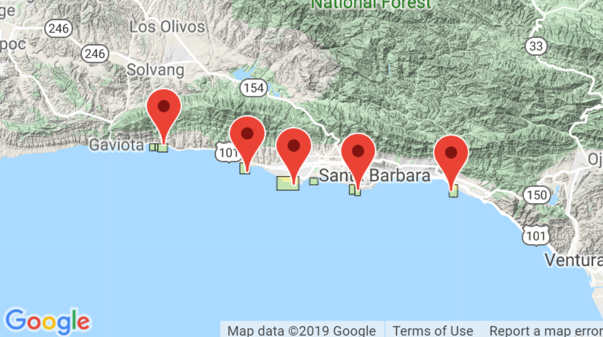

```{r setup, include=FALSE, warning=FALSE, message=FALSE}
knitr::opts_chunk$set(echo = FALSE, warning = FALSE, message = FALSE)
```

### Introduction


The California Spiny Lobster (*panulirus interruptus*) is an important species in the kelp forests in California. Lobsters are a vital predator of kelp-eating sea urchins. Without predation, sea urchins have the ability to demolish kelp forests and create urchin barrens, destroying the ecological diversity that kelp forests create.

The Santa Barbara Chanel Long Term Ecological Research (SBC LTER)


[Catalina Island Marine Institute(https://cimioutdoored.org/wp-content/uploads/2017/09/California-Spiny-Lobster.jpg)]




### Data and Methods

Data for this project was collected from 2012-2018 by the Santa Barbara Chanel Long Term Ecological Research team. Lobster numbers and sizes were collected by divers at 5 sites, including two Marine Protected Areas (Naples and Isla Vista) and three (Arroyo Quemado, Mohawk and Carpinteria). All samples were gathered in the late summer before the start of the fishing season.
 

Naples and Isla Vista were designated Marine Protected Areas in January 2012

### Results

##### Results A

group by year, showing changes in annual lobster abundance at the five sites over time

```{r, echo=FALSE}
# -------------------------
# Attach necessary packages
# -------------------------
library(tidyverse)
library(janitor)
library(directlabels)
library(kableExtra)
library(ggrepel)
library(plotly)

```

```{r, echo=FALSE}
# ------------------------------
# Create clean data for Graph A
# ------------------------------

lobster_df <- read_csv("lobster_abundance_sbc_lter.csv", 
# Read in lobster_abundance_sbc_lter,csv
# and assign it to an object.                      
                        na = "-99999") %>% 
# Change -99999 values to na's.
# Pipe to move to the next step.
  clean_names()
# Simplify names to contain only _, character, 
# numbers, and letters.

lobster_year <- lobster_df %>% 
# Call the data and assign it to an object.
# Pipe to move to the next step.
  group_by(site, year) %>% 
# Group receiving site and year by collapsing 
# multiple data points into a single row,
# based on what is summarized in the next step.
# Pipe to move to the next step.
  summarize("total" = sum(count)) %>% 
# Summarize (new column = whatever you're doing(metric)).
  mutate("MPA" = ifelse(site == "IVEE", "MPA",
                        ifelse(site == "NAPL", "MPA", "Non-MPA"))) %>% 
# Create a new column differientiating sites as MPA or Non-MPA.
# Pipe to move to the next step.
  mutate("site_name" = ifelse(site == "IVEE", "Isla Vista",
                              ifelse(site == "NAPL", "Naples",
                                     ifelse(site == "CARP", "Carpinteria",
                                            ifelse(site == "AQUE", "Arroyo Quemado", "Mohawk"))))) 
# Create a new column containing non-abbreviated site names.

```

```{r, echo=FALSE}
# ---------------
# Check out data
# ---------------

View(lobster_year)

```


```{r}
# ---------------
# Create Graph A
# ---------------

ggplot(data = lobster_year, aes(x = year, y = total, group = site)) + 
# Create a graph and call out data to be used,
# including what the x and y variables are.
# To create individual lines by site, need group = site.
  geom_line(aes(color = MPA), size = 1.2) +
# Color lines by site and specify line size.
  labs(color = "Marine Protected Area (MPA)",
       x = "Year",
       y = "Annual lobster abundance (counts)",
       title = "Changes in annual lobster abundance (counts) by site") + 
# Use color to create the legend title and create 
# labels for the x and y axes and title.
  theme_light() +
# Call out a theme to tweak the display of an existing theme.
  geom_dl(aes(label = site_name), 
          method = list(dl.combine("last.points"), 
                        cex = .8)) + 
# Use geom_dl for direct labels on the lines, cex is font size, 
# method needs to be written like this.
  theme(legend.position = c(0.29, 0.837)) + 
# Manually reposition legend.
  scale_x_continuous(expand = c(0,0),
                     limits = c(2012,2020.5)) + 
# Needed to expand limits for site names.
  scale_y_continuous(expand = c(0,0),
                     limits = c(0, 1000)) +
# Needed to expand limits for site names.
  scale_color_manual(breaks = c("MPA", "Non-MPA"), values = c("royalblue4", "sandybrown")) +
# Manually change line colors in graph based on 
# whether a site is MPA or Non-MPA.
  labs(caption = bolditalic("Figure 1.")~italic("more caption")) 
# Create caption below the graph and edit font size and style.

```

```{r, echo=FALSE}
# ------------------------------
# Create clean data for Graph B
# ------------------------------

lobster_size <- lobster_df %>% 
# Call out data and assign it to an object.
# Pipe to move to the next step.
  filter(year %in% c("2012", "2018")) %>% 
# Filter out the observations during the years 2012 and 2018.
  group_by(site, year) %>% 
# Group receiving site and year by collapsing 
# multiple data points into a single row.
# Pipe to move to the next step.
  select(year, site, size_mm) %>% 
# Select specific columns to keep in the data frame.
  mutate("MPA" = ifelse(site == "IVEE", "MPA",
                        ifelse(site == "NAPL", "MPA", "Non-MPA"))) %>% 
# Create a new column differientiating sites as MPA or Non-MPA.
# Pipe to move to the next step.
  mutate("site_name" = ifelse(site == "IVEE", "Isla Vista",
                              ifelse(site == "NAPL", "Naples",
                                     ifelse(site == "CARP", "Carpinteria",
                                            ifelse(site == "AQUE", "Arroyo Quemado", "Mohawk")))))
# Create a new column containing non-abbreviated site names.  
lobster_size$site_name <- factor(lobster_size$site_name , levels=c("Mohawk", "Carpinteria", "Arroyo Quemado", "Naples", "Isla Vista"))
# Create a specific order for the observations according to site names.

```

```{r}
# ---------------
# Create Graph B
# ---------------

ggplot(data = lobster_size, 
       aes(y = size_mm, x = site_name, fill = as.character(year))) +
# Create a graph and call out data to be used,
# including what the x and y variables are.
# Assign year as a character rather than a numeric value 
# to be able to group it.
  geom_point(position=position_jitterdodge(), 
# Call out the type of graph and use jitterdodge
# to differentiate site specific data according to the year.
             alpha=0.2, aes(color = site_name),
              show.legend = FALSE,
              size = 1) +
# Specify dot size and transparency.
# Assign colors to the different sites. 
  scale_color_manual(breaks = c("MPA", "Non-MPA"), values = c("sandybrown", "sandybrown", "sandybrown", "royalblue4","royalblue4")) +
# Manually assign colors to each site in a specific order.
  geom_boxplot(alpha = 0.75, outlier.color = NA) +
# Create a box plot graph.
  scale_fill_grey(name = "Year") +
# Assign gray colors to the box plot graph.
# Create a title for the legend.
  theme_minimal() +
# Call out a theme to tweak the display of an existing theme.
  labs(title = "Lobster size distribution shifts in 2012 vs. 2018",
     x = "Year", 
     y = "Size (mm)",
     caption = bolditalic("Figure 2.")~italic("more caption")) +
# Create labels for the x and y axes and title.
# Create caption below the graph and edit font size and style.
    geom_vline(xintercept = 3.5, 
             linetype = "dashed", 
             color = "black", 
             size = .5) +
# Create a vertical line and call out the line
# type, color, and size.
  annotate("text", x = 2,
           y = 140,
           label = c("Non-MPA"),
           size = 3) +
# Add text to a specific point on the graph and call out
# the font size.
    annotate("text", x = 4.5,
           y = 140,
           label = c("MPA"),
           size = 3) +
# Add text to a specific point on the graph and call out 
# the font size. 
  geom_point(aes(x = 1.65,
                 y = 140),
             colour = "sandybrown",
             size = 1,
             show.legend = FALSE) +
# Add a bullet to a specific point on the graph and call out
# the color and size.
  geom_point(aes(x = 4.3,
                 y = 140),
             colour = "royalblue4",
             size = 1,
             show.legend = FALSE)
# Add a bullet to a specific point on the graph and call out
# the color and size.

```

```{r}
# ------------------------------
# Create clean data for Graph c
# ------------------------------

lobster_size_av <- lobster_size %>% 
  group_by(MPA, year) %>% 
  summarize(mpa_av = mean(size_mm, na.rm = TRUE)) %>% 
  filter(year %in% c(2012, 2018))

```

```{r}
# ---------------------------------------------------
# Create data for part 1 of Graph C - MPA sites only
# ---------------------------------------------------

lobster_size_mpa <- lobster_size %>%
# Call out data and assign it to an object.
# Pipe to move to the next step.
  filter(MPA %in% c("MPA"))
# Filter out the observations that are MPA.

```

```{r}
# ---------------------------------------------------
# Create data for part 1 of Graph C - MPA sites only
# ---------------------------------------------------

ggplot(data = lobster_size_mpa, aes(x = size_mm,
# Create a graph and call out data to be used,
# including what the x variable is.
                                    fill = as.character(year),
                                    color = as.character(year))) +
# Using as.character allows me to group them by year.
  geom_density(alpha = 0.3) +
  scale_fill_manual(breaks = c("2012", 
                               "2018"), 
                    values = c("royalblue4", 
                               "royalblue1")) +
# Specify colors for the fill of the curves.
  scale_color_manual(breaks = c("2012", 
                                "2018"), 
                     values = c("royalblue4", 
                                "royalblue1")) +
# Specify colors for the lines.
  theme_minimal() +
  theme(legend.position = "none") + # don't want a legend, label manually
  annotate(
    geom = "curve", # geom="curve" for curved line, geom="segment" for straight
    x = 120, # line start
    y = 0.035, # line start
    xend = 86,  # line end
    yend = 0.028,  # line end
    curvature = .2, # level of curve
    color = "royalblue1"
  ) + 
  # values entered manually for where I want lines to begin and end
  annotate(geom = "text", 
           x = 121, # where my text will be
           y = 0.035, # where my text will be
           label = "2018", 
           hjust = "left", 
           color = "royalblue1") + # annotation for 2018
  annotate(
    geom = "curve", # geom="curve" for curved line, geom="segment" for straight
    x = 85, # start of line
    y = 0.045, # start of line
    xend = 65, # end of line
    yend = 0.037, # end of line
    curvature = .2, # level of curve
    color = "royalblue4"
  ) + 
  # values entered manually for where I want the lines to begin and end
  annotate(geom = "text", 
           x = 86, # where my label will sit
           y = 0.047, # where my label will sit
           label = "2012", 
           hjust = "left", 
           color = "royalblue4") + # annotation for 2012
  geom_vline(xintercept = 67.7,
             color = "royalblue4",
             linetype = "dashed",
             size = 0.5) +
  geom_vline(xintercept = 77.76581,
             color = "royalblue1",
             linetype = "dashed",
             size = 0.5) + # means taken from lobster_size_av dataframe
  # vline allows me to draw a vertical line of the mean
  labs(x = "Lobster Length (mm)",
       y = "Kernel Density",
       caption = bolditalic("Figure 3.")~italic("more caption"))
```

```{r}
# ------
# graph for Non-MPA sites
# ------

lobster_size_non_mpa <- lobster_size %>% 
  filter(MPA %in% c("Non-MPA"))

ggplot(data = lobster_size_non_mpa, aes(x = size_mm, 
                                        fill = as.character(year),
                                        color = as.character(year))) +
  # as.character allows me to graph by year
  geom_density(alpha = 0.3) +
  scale_fill_manual(breaks = c("2012", 
                               "2018"), 
                    values = c("tomato3", 
                               "sandybrown")) +
  # color for fill of the curve
  scale_color_manual(breaks = c("2012", 
                                "2018"), 
                     values = c("tomato3", 
                                "sandybrown")) +
  # color for lines
  theme_minimal() +
  theme(legend.position = "none") + # don't want a legend, label manually
  annotate(
    geom = "curve", # geom="curve" for curved line, geom="segment" for straight
    x = 117, # line start
    y = 0.035, # line start
    xend = 84, # line end
    yend = 0.028, # line end
    curvature = .2, # level of curve
    color = "sandybrown"
  ) + 
  annotate(geom = "text", 
           x = 119, # where my annotation text is
           y = 0.037, # where my annotation text is
           label = "2018", 
           hjust = "left", 
           color = "sandybrown") + # label for 2018
  annotate(
    geom = "curve", # geom="curve" for curved line, geom="segment" for straight
    x = 120, # line start
    y = 0.015, # line start
    xend = 95,  # line end
    yend = 0.007, # line end
    curvature = .2, # level of curve
    color = "tomato3"
  ) + 
  annotate(geom = "text", 
           x = 121, # where my annotation will be
           y = 0.016, # where my annotation will be
           label = "2012", 
           hjust = "left", 
           color = "tomato3") + # label for 2012
  geom_vline(xintercept = 74.22581,
             color = "tomato3",
             linetype = "dashed",
             size = 0.5) +
  geom_vline(xintercept = 73.82468,
             color = "sandybrown",
             linetype = "dashed",
             size = 0.5) + # means taken from lobster_size_av dataframe
  # vline allows me to draw a vertical line for the means
  labs(x = "Lobster Length (mm)",
       y = "Kernel Density",
       caption = bolditalic("Figure 4.")~italic("more caption"))
```

